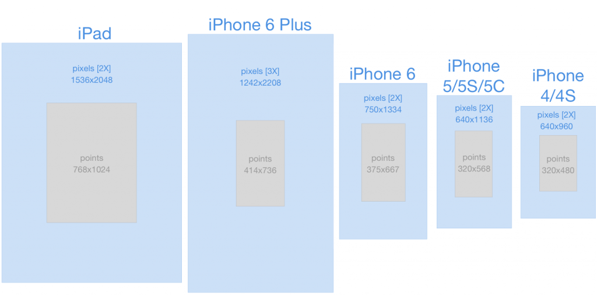

# Swift 문법
> 2018.02.01 업데이트    

## UI Base
* Pixel : 실제 이미지 사이즈   
* Point : 화면에 표시되는 이미지 사이즈    

출처 : http://jasonprini.com/the-new-ios-canvas/
> 화면 기술의 발전으로 pixel단위로 개발할 경우 디스플레이마다 보여지는 크기가 다르기 때문에, 포인트 개념을 사용하여 UI크기의 통일성을 줄 수 있다.

### 좌표계(Frame-Base)
* 좌표계 : View기준 좌측 상단이 0, 0이다.   
* View의 위치는 상대적으로 상위뷰(super view)를 기준으로 위치를 잡는다.  
> 상위뷰의 크기를 구할 때는 `super.view.frame.size.width` (가로 크기)로 구한다. 세로 크기는 width 대신 height를 사용한다.

### 프레임워크(Framework) 란
* 애플리케이션 프레임워크(Application Framework)는 프로그래밍에서 특정 운영 체제를 위한 응용 프로그램 표준 구조를 구현하는 클래스와 라이브러리 모임이다. 간단하게 프레임워크라고도 부른다.  
* 재사용할 수 있는 수많은 코드를 프레임워크로 통합함으로써 개발자가 새로운 애플리케이션을 위한 표준 코드를 다시 작성하지 않아도 같이 사용된다.   
* 프레임워크의 구현은 객체 지향 프로그래밍 기법이 사용되고 있는 응용 프로그램 고유의 클래스가 프레임워크의 기존 클래스를 상속할 수 있다.

#### UIKit Framework
* Cocoa Touch Framework에 추가된 UI관련 기능의 클래스가 모여있는 Framework
* `import UIKit` 로 선언

출처 : http://machinethink.net/blog/mixins-and-traits-in-swift-2.0/

### UIResponder
* 이벤트에 응답하고 처리하기위한 추상 인터페이스

